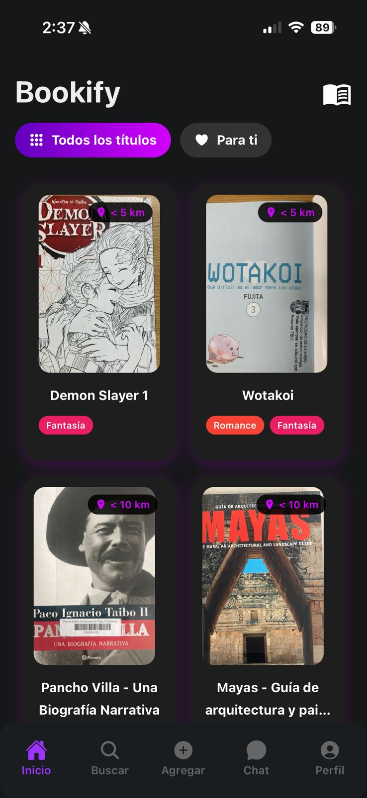

# Bookify

Bookify es una plataforma móvil diseñada para fomentar la lectura mediante el intercambio de libros entre usuarios. La aplicación permite a los lectores dar una segunda vida a sus libros, descubrir nuevas lecturas cercanas a su ubicación física y conectar con una comunidad activa de amantes de la literatura.

El objetivo principal es facilitar el acceso a la lectura de manera económica y sustentable, promoviendo la economía circular a través del intercambio de libros.

# 
#  
## Características Principales

* **Exploración Georreferenciada:** Visualización de libros disponibles cerca de tu ubicación mediante un mapa interactivo.
* **Gestión de Biblioteca Personal:** Los usuarios pueden subir sus libros, agregar fotos y gestionar su disponibilidad.
* **Búsqueda y Filtros:** Búsqueda avanzada de títulos y filtrado por géneros literarios.
* **Intercambio y Chat:** Sistema integrado de chat en tiempo real para coordinar los intercambios entre usuarios.
* **Perfil y Reputación:** Perfiles de usuario con historial de lecturas y sistema de calificaciones (Rating) para generar confianza en la comunidad.
* **Notificaciones:** Alertas sobre mensajes y estado de los intercambios.

## Stack Tecnológico

El proyecto está dividido en dos partes principales: una API RESTful y una aplicación móvil.

### Backend (API)
* **Framework:** NestJS (Node.js).
* **Base de Datos:** PostgreSQL con TypeORM.
* **Almacenamiento de Imágenes:** AWS S3.
* **Autenticación:** JWT.
* **Mapas/Ubicación:** Integración con servicios de geolocalización.

### Frontend (Móvil)
* **Framework:** React Native con Expo.
* **Lenguaje:** TypeScript.
* **Estilos:** NativeWind (TailwindCSS).
* **Navegación:** Expo Router.
* **Mapas:** React Native Maps.

## Pre-requisitos

Antes de comenzar, asegúrate de tener instalado:
* Node.js (LTS recomendado).
* Gestor de paquetes npm.
* Dispositivo móvil con Expo Go instalado o un emulador (Android Studio/Xcode).

## Instalación y Ejecución

Para ejecutar el proyecto completo, necesitarás dos terminales abiertas: una para el Backend y otra para el Frontend.

### 1. Configuración del Backend (Servidor)

Navega al directorio del servidor:

```bash
cd Bookify/bookify-back
```

Instala las dependencias:

```bash
npm install
```

Configuración de Variables de Entorno:
Crea un archivo `.env` en la raíz de `bookify-back` configurando las credenciales de tu base de datos PostgreSQL y las llaves de AWS necesarias (`DB_HOST`, `DB_PORT`, `DB_USERNAME`, `DB_PASSWORD`, `DB_NAME`, etc.).

Inicia el servidor en modo desarrollo:

```bash
npm run start:dev
```

El servidor generalmente correrá en el puerto 3000.

### 2. Configuración del Frontend (App Móvil)

Navega al directorio de la aplicación:

```bash
cd Bookify/Bookify
```

Instala las dependencias:

```bash
npm install
```

Configuración de IP Local:
Es crucial configurar la IP de tu máquina para que el celular pueda comunicarse con el backend. Crea o edita el archivo `.env` en la carpeta `Bookify/Bookify`:

```env
# Reemplaza 'tu-ip' con tu dirección IPv4 local (ej. 192.168.1.5)
EXPO_PUBLIC_API_URL=http://tu-ip:3000
```

**Nota:** No uses `localhost` si vas a probar en un dispositivo físico, usa la IP de tu red.

Inicia la aplicación con Expo:

```bash
npx expo start
```

Escanea el código QR con la app Expo Go (Android) o usa la cámara (iOS) para abrir la aplicación.